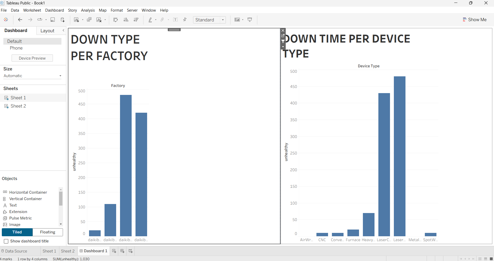

# Factory Downtime Analysis Dashboard

## 📊 Project Overview
This project analyzes machine downtime across different factories and device types using Tableau

## 🛠 Tools Used
- Tableau

## 📌 Key Insights
- Identified factories with highest downtime
- Compared downtime across device types
- Highlighted major causes of machine failure

## 📷 Dashboard Preview

## 📁 Additional Work
- Equality Table Analysis (Excel) – completed as part of Forage virtual internship
- ## 🛠 Tools Used
- Excel
